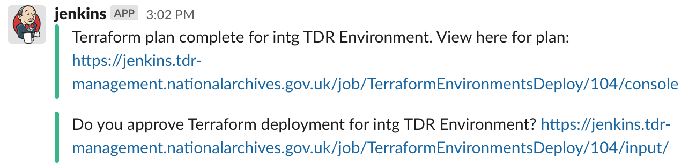

# TDR Terraform Environments

**Important Note**: tdr-terraform-environments uses >= v1.12.2 of Terraform. Ensure that Terraform >= v1.12.2 is installed before proceeding.

This repository contains the Terraform code to create the AWS resources needed to support the TDR application

## Terraform Structure

The prototype is divided into separate Terraform modules that represent the different AWS resources that are needed for the TDR project.

The different modules are used by Terraform workspaces which represent three AWS environments:

* intg
* staging
* prod

## Deployment

These scripts assume that the [Terraform backend has been created in the management account][tf-backend]. This project uses the S3 Terraform backend to store the Terraform state for the different TDR environments.

To start a deployment, run the [TDR Terraform Environments Deploy job in GitHub actions][github-actions-job] by clicking 'Run Workflow' and selecting the environment you want to deploy to. All changes must be deployed first to integration, then staging, then production. 

The deployment will pause when Terraform has determined which changes need to be applied. Review the Terraform plan output by clicking the link provided in the Slack notification. This will be a link to Cloudwatch in the management account so you will need to be logged in to the management AWS account to use this.

Check whether the changes look correct, then open the actions approval page and accept or reject them. To find the actions approval page, follow the link from the Slack notification:



Integration deployments can be approved by anyone in the `transfer-digital-records` GitHub team. Staging and Production deployments need to be approved by a member of the `transfer-digital-records-admins`

Integration and staging deployments will automatically start the [end-to-end tests]. Wait for these to succeed before deploying the Terraform to the next environment, as well as doing any manual checks you need to make sure the deployment made the change you expected.

### Adding/Updating Lambda Environment Variables

If you are adding an environment variable for a lambda that needs to be populated with an encrypted, manually added value from the SSM Parameter store, you will need to apply the changes twice. 
1. Apply changes in order to set up SSM parameter and Lambda environment variable
2. Manually enter unencrypted value in SSM parameter store
3. Apply changes a second time to push encrypted value from SSM parameter into the environment variable

[tf-backend]: https://github.com/nationalarchives/tdr-dev-documentation/tree/master/manual/tdr-create-aws-instructure-setup.md
[github-actions-job]: https://github.com/nationalarchives/tdr-terraform-environments/actions/workflows/apply.yml
[end-to-end tests]: https://github.com/nationalarchives/tdr-e2e-tests/actions/workflows/ci.yml

## Local development

### Install Terraform locally

See: https://learn.hashicorp.com/terraform/getting-started/install.html

### Install AWS CLI Locally

See: https://docs.aws.amazon.com/cli/latest/userguide/cli-chap-install.html

### Install Terraform Plugins on Intellij

HCL Language Support: https://plugins.jetbrains.com/plugin/7808-hashicorp-terraform--hcl-language-support

### Add AWS Credentials and Profiles

1. Update local AWS credentials file (~/.aws/credentials) with a user's credentials for the TDR AWS management account:

   ```
   ... other credentials ...

   [terraform]
   aws_access_key_id = ... terraform user access key ...
   aws_secret_access_key = ... terraform user secret access key ...
   ```

## Running Terraform Project Locally

**NOTE: Running Terraform locally should only be used to check the Terraform plan. Updating the TDR environments should only ever be done through Jenkins**

1. Clone TDR Environments project to local machine: https://github.com/nationalarchives/tdr-terraform-environments

2. In command terminal navigate to the folder where the project has been cloned to

3. Clone TDR Configurations repository
   ```
   [location of project] $ git clone git@github.com:nationalarchives/tdr-configurations.git
   ```

4. Clone Terraform modules repository.
   
   ```
   [location of project] $ git clone git@github.com:nationalarchives/tdr-terraform-modules.git   
   ```
   
5. Clone DA Terraform Configurations repository

   ```
   [location of project] $ git clone https://github.com/nationalarchives/da-terraform-configurations.git
   ```

6. Clone DA Terraform Modules repository

   ```
   [location of project] $ git clone https://github.com/nationalarchives/da-terraform-modules.git
   ```

7. Create Terraform workspaces corresponding to the TDR environments:

   ```
   [location of project] $ terraform workspace new intg

   [location of project] $ terraform workspace new staging

   [location of project] $ terraform workspace new prod
   ```
8. Switch to the Terraform workspace corresponding to the TDR environment to be worked on:

   ```
   [location of project] $ terraform workspace select intg
   ```

9. Run the following command to ensure Terraform uses the correct credentials:

   ```
   [location of project] $ export AWS_PROFILE=terraform
   ```

10. Set the following Terraform environment variables on the local environment:

    * TF_VAR_tdr_account_number=*[account number of the environment to update]*
    
11. Initialize Terraform (if not done so previously):

   ```
   [location of project] $ terraform init   
   ```
12. Run Terraform to view changes that will be made to the TDR environment AWS resources

   ```
   [location of project] $ terraform plan
   ```
13. Run `terraform fmt --recursive` to properly format your Terraform changes

14. Before you push the changes made in terraform-environments directory, if you've made changes to a sub-module (`tdr-terraform-modules` or `tdr-configurations`), push and get those changes
merged (`cd {sub-module name}`) and then update the sub-module hashes (instructions on how to do this are below) before moving onto the next step.

15. Commit and push all the changes made in the terraform-environments directory to its GitHub repo, then (in the GitHub repo):

Go the Actions tab -> Click ["Terraform Apply"] -> Click "Run workflow" -> select the branch with the workflow file you want to use -> Click the green "Run worklfow" button

["Terraform Apply"]: https://github.com/nationalarchives/tdr-terraform-environments/actions/workflows/apply.yml

## Updating sub-module hashes

The tdr-terraform-modules, tdr-configurations and da-terraform-configurations are sub-modules to the tdr-terraform-environment projects.

To update the hashes for the sub-modules, following an update to them:

1. On the command line go to the sub-module directory in the tdr-terraform-environment directory

   ```
   [location of project] $ cd tdr-terraform-modules
   ```
   Or
   ```
   [location  of project] $ cd tdr-configurations
   ```
   Or
   ```
   [location  of project] $ cd da-terraform-configurations
   ```
2. Ensure you are on the Git main branch for the sub-module   
3. Pull the latest main branch for the sub-module

   ```
   [location of sub-module] $ git pull
   ```

4. Go back to the main tdr-terraform-environments directory

   ```
   [location of sub-module] $ cd ..
   ```
   
5. Check that the sub-module is now showing as a change

   ```
   [location of project] $ git status
   ```

6. Commit and merge the sub-module change as any other normal change to the code


## Further Information

* Terraform website: https://www.terraform.io/
* Terraform basic tutorial: https://learn.hashicorp.com/terraform/getting-started/build
