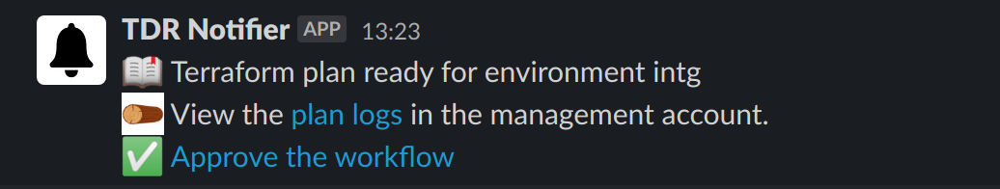

# TDR Terraform Environments

**Important Note**: tdr-terraform-environments uses v1.1.3 of Terraform. Ensure that Terraform v1.1.3 is installed before proceeding.

This repository contains the Terraform code to create the AWS resources needed to support the TDR application

## Terraform Structure

The prototype is divided into separate Terraform modules that represent the different AWS resources that are needed for the TDR project.

The different modules are used by Terraform workspaces which represent three AWS environments:

* intg
* staging
* prod

## Deployment

These scripts assume that the [Terraform backend has been created in the management account][tf-backend]. This project uses the S3 Terraform backend to store the Terraform state for the different TDR environments.

To start a deployment, run the [TDR Terraform Environments Deploy job in Jenkins][jenkins-job] by clicking 'Build with Parameters' and selecting the environment you want to deploy to. All changes must be deployed first to integration, then staging, then production.

The deployment will pause when Terraform has determined which changes need to be applied. Review the Terraform plan output by opening the job's console output.

Check whether the changes look correct, then open the build input page and accept or reject them. To find the build input page, follow the link from the Slack notification:



Or click the "Paused for input" link in the Jenkins job detail:


Integration and staging deployments will automatically start the [end-to-end tests]. Wait for these to succeed before deploying the Terraform to the next environment, as well as doing any manual checks you need to make sure the deployment made the change you expected.

[tf-backend]: https://github.com/nationalarchives/tdr-dev-documentation/tree/master/manual/tdr-create-aws-instructure-setup.md
[jenkins-job]: https://jenkins.tdr-management.nationalarchives.gov.uk/job/TerraformEnvironmentsDeploy/
[end-to-end tests]: https://jenkins.tdr-management.nationalarchives.gov.uk/job/TDRAcceptanceTest/

## Local development

### Install Terraform locally

See: https://learn.hashicorp.com/terraform/getting-started/install.html

### Install AWS CLI Locally

See: https://docs.aws.amazon.com/cli/latest/userguide/cli-chap-install.html

### Install Terraform Plugins on Intellij

HCL Language Support: https://plugins.jetbrains.com/plugin/7808-hashicorp-terraform--hcl-language-support

### Add AWS Credentials and Profiles

1. Update local AWS credentials file (~/.aws/credentials) with a user's credentials for the TDR AWS management account:

   ```
   ... other credentials ...

   [terraform]
   aws_access_key_id = ... terraform user access key ...
   aws_secret_access_key = ... terraform user secret access key ...
   ```

## Running Terraform Project Locally

**NOTE: Running Terraform locally should only be used to check the Terraform plan. Updating the TDR environments should only ever be done through Jenkins**

1. Clone TDR Environments project to local machine: https://github.com/nationalarchives/tdr-terraform-environments

2. In command terminal navigate to the folder where the project has been cloned to

3. Clone TDR Configurations repository
   ```
   [location of project] $ git clone git@github.com/nationalarchives/tdr-configurations.git
   ```

4. Clone Terraform modules repository.
   
   ```
   [location of project] $ git clone git@github.com:nationalarchives/tdr-terraform-modules.git   
   ```

5. Create Terraform workspaces corresponding to the TDR environments:

   ```
   [location of project] $ terraform workspace new intg

   [location of project] $ terraform workspace new staging

   [location of project] $ terraform workspace new prod
   ```
6. Switch to the Terraform workspace corresponding to the TDR environment to be worked on:

   ```
   [location of project] $ terraform workspace select intg
   ```

7. Run the following commands to ensure Terraform uses the correct credentials:

   ```
   [location of project] $ export AWS_PROFILE=terraform
   ```

8. Set the following Terraform environment variables on the local environment:

    * TF_VAR_tdr_account_number=*[account number of the environment to update]*
    
9. Set the following environmental variables:

   ```
   [location of project] $ export GITHUB_TOKEN=[valid token with access to TDR GitHub repos. Can use token from SSM parameter store: /mgmt/github/jenkins-api-key]
   [location of project] $ export GITHUB_OWNER=nationalarchives
   ```
   
10. Initialize Terraform (if not done so previously):

   ```
   [location of project] $ terraform init   
   ```

11. Run Terraform to make changes to the TDR environment AWS resources

   ```
   [location of project] $ terraform plan
   ```
## Further Information

* Terraform website: https://www.terraform.io/
* Terraform basic tutorial: https://learn.hashicorp.com/terraform/getting-started/build
